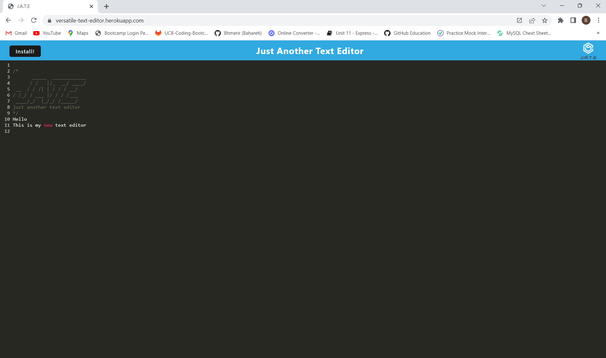

# Versatile Text Editor

## Description 
---

These days, because of lots of distractions in people's life, text editors are very useful in organizing online lives. This application is a progressive web application(PWA) which helps people to write any texts and retrieve them whenever desired. It is an installable application which makes it accessible on every device and it can works even offline and in poor connection situations. 

 

This application is capable of the following actions:

1. save the written text into the indexedDB of the client-side browser

2. retrieve the saved data whenever the page is loaded or refreshed

3. be installed in any devices and be accessible from an icon on user's device(like their desktop)

4. be used in offline mode after installation

5. have the static assets pre cached upon loading along with subsequent pages and static assets

6. have a registered service worker using workbox

 

## Table of Contents
---

* [Description](#description)

* [Mock Up](#mock-up)

* [Usage](#usage)

* [Technology Used](#technology-used)

* [Questions](#questions)

* [Credit](#credit)

* [License](#license)

 

## Mock Up

---

 

## Usage

---

This is the link of deployed site. Go there and enjoy of this free and open platform.

[Link of deployed site](https://versatile-text-editor.herokuapp.com)

 

## Technology Used

---

| Technology Used                  |
| -------------                    |
| JavaScript                       |  
| Node.js                          |  
| Express.js                       |
| @babel/core Module               |
| @babel/preset-env Module         |
| babel-loader Module              |
| css-loader Module                |
| html-webpack-plugin Module       |
| style-loader Module              |
| webpack Module                   |
| webpack-cli Module               |
| webpack-dev-server Module        |
| webpack-pwa-manifest Module      |
| workbox-webpack-plugin Module    |
| idb                              |

 

## Questions 

---

If you have any additional questions, you can send me an email to :

[My Email Address](mailto:(mer_ir@yahoo.com))

 

## Credit

---

Name:     Bahareh Hosseini

Github page:      [https://github.com/Bhmerir](https://github.com/Bhmerir)

 

## License

---

MIT License

Permission is hereby granted, free of charge, to any person obtaining a copy
of this software and associated documentation files (the "Software"), to deal
in the Software without restriction, including without limitation the rights
to use, copy, modify, merge, publish, distribute, sublicense, and/or sell
copies of the Software, and to permit persons to whom the Software is
furnished to do so, subject to the following conditions:

The above copyright notice and this permission notice shall be included in all
copies or substantial portions of the Software.

THE SOFTWARE IS PROVIDED "AS IS", WITHOUT WARRANTY OF ANY KIND, EXPRESS OR
IMPLIED, INCLUDING BUT NOT LIMITED TO THE WARRANTIES OF MERCHANTABILITY,
FITNESS FOR A PARTICULAR PURPOSE AND NONINFRINGEMENT. IN NO EVENT SHALL THE
AUTHORS OR COPYRIGHT HOLDERS BE LIABLE FOR ANY CLAIM, DAMAGES OR OTHER
LIABILITY, WHETHER IN AN ACTION OF CONTRACT, TORT OR OTHERWISE, ARISING FROM,
OUT OF OR IN CONNECTION WITH THE SOFTWARE OR THE USE OR OTHER DEALINGS IN THE
SOFTWARE.

---

© 2023 Confidential and Proprietary. All Rights Reserved.
